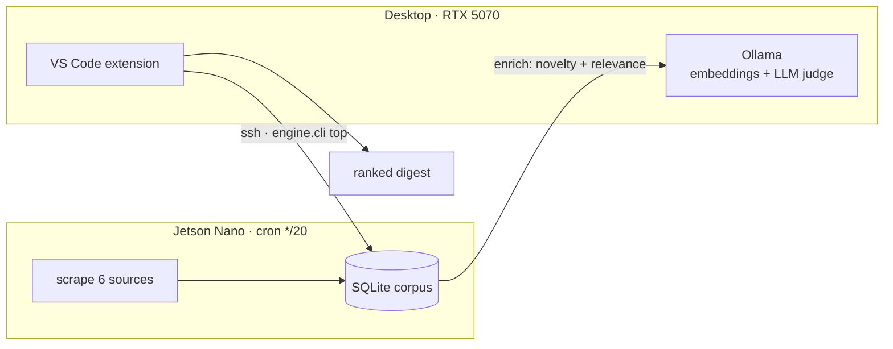

# AI early-signal scraper

Local, Ollama-powered scraper that surfaces **emerging, not-yet-mainstream AI tech
news** from arXiv, Hacker News, Reddit, GitHub, and Hugging Face — ranked by
velocity, novelty, relevance, and earliness. No paid APIs, no cloud LLM cost.

> **See it without running anything:** [`docs/sample-digest.html`](docs/sample-digest.html)
> is a real, self-contained digest — open it in any browser (no engine, Jetson, or network
> needed). _(Becomes a live GitHub Pages link once published.)_

**At a glance:** ~2,900-item corpus · 6 free sources · local-LLM enrichment (zero cloud cost) ·
collects every 20 min on a Jetson Nano · embedding-based novelty dedup + velocity ranking ·
a real VS Code extension · CI + one-command deploy.



## How it finds "not mainstream yet"

1. **Early-signal sources** — arXiv + HN `new` + r/LocalLLaMA surface things before
   the press does.
2. **Velocity over volume** — ranks by engagement *rate* (stars/upvotes per hour),
   tracked across runs in `state.db`, so a fast-rising small item beats a big stale one.
3. **Novelty via embeddings** — every surfaced item is embedded (`nomic-embed-text`);
   new candidates too similar to past ones are dropped, killing repeat coverage.
4. **Mainstream suppression** — items pointing at techcrunch/verge/nyt/etc. are
   downranked as "already broke."
5. **Local LLM judge** — `llama3.1:8b` scores each survivor on relevance + earliness.

## Setup

```bash
cd "spiders"
python -m venv .venv
.venv\Scripts\activate            # PowerShell: .venv\Scripts\Activate.ps1
pip install -r requirements.txt
```

Make sure Ollama is running with the models pulled:

```bash
ollama pull nomic-embed-text
ollama pull llama3.1:8b
```

## Run

```bash
python -m engine.cli run            # writes digests/latest.md + a timestamped copy
python -m engine.cli run --json     # JSON to stdout (used by the VS Code extension)
```

Tune everything in [`config.toml`](config.toml): sources, subreddits, keywords,
focus prompt, scoring weights, mainstream domains. Optionally set `GITHUB_TOKEN`
to raise the GitHub rate limit.

## VS Code extension

The `extension/` shell gives you a status-bar button + hotkeys (`Ctrl+Alt+A` Top now,
`Ctrl+Alt+T` Top on topic) that SSH into the Jetson and open the ranked digest.

## Architecture (hybrid)

```
JETSON (jetson@192.168.55.1)            DESKTOP (RTX 5070)
  cron */20 → engine.cli collect          Ollama (llama3.1:8b + nomic-embed-text)
    scrape → store → enrich ─────calls────▶  (enrichment GPU)
    state.db (corpus)                       VS Code extension ──ssh──▶ engine.cli top
```
The Jetson scrapes + stores nonstop; enrichment (embeddings + LLM judge) runs on the
desktop's Ollama. Internet for the Jetson is shared from the desktop (ICS).

## Development & CI/CD

```bash
pip install -r requirements-dev.txt
python -m pytest                 # engine unit tests (ranking, store, config)
```

**Ship a change with one command** (tests gate the deploy):

```powershell
./scripts/deploy.ps1 -Message "tune ranking weights"
#   1. pytest            (abort on failure)
#   2. scp engine + config → Jetson   (cron picks it up next cycle)
#   3. remote smoke test  (top --json must return valid JSON)
#   4. rebuild + reinstall the VS Code extension (auto patch-bump)
#   5. git commit
# flags: -SkipExtension (engine-only), -SkipTests, -NoCommit
```

**CI** ([`.github/workflows/ci.yml`](.github/workflows/ci.yml)) runs the pytest suite
and compiles the extension on every push / PR. Deployment stays local because the
Jetson is only reachable from the desktop (USB link), not from cloud runners.
